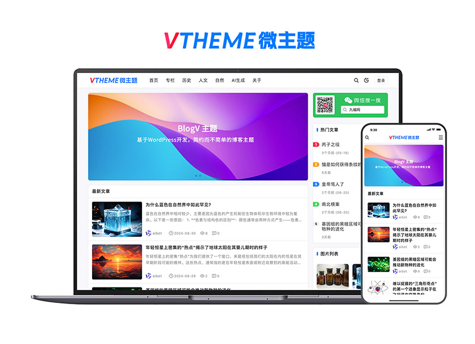

Nine 主题
======

### 主题简介
Nine 是一款 WordPress 主题，无需任何代码，轻点鼠标即可对主题和网站进行设置，组合出各种丰富多彩的页面。

### 主题功能
- 自适应设计（完美兼容电脑、平板，手机访问）
- 暗黑模式
- 强大主题设置面板
- 强大幻灯片功能
- 一键导入主题演示数据
- 无限主题颜色（红、黄、蓝、绿、紫、橙…）
- 多级子菜单支持
- 完美兼容Chrome、Firefox、Safari、360等主流浏览器
- 使用最新的的 ESM6，使用 rollup 打包，加载速度快
- 可以关闭网站前端，只对外提供接口服务
- 支持对文章的收藏点赞

### LICENSE
遵循GPL协议，非商业用途免费使用，请保留底部版权

